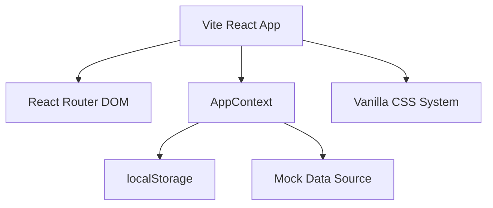
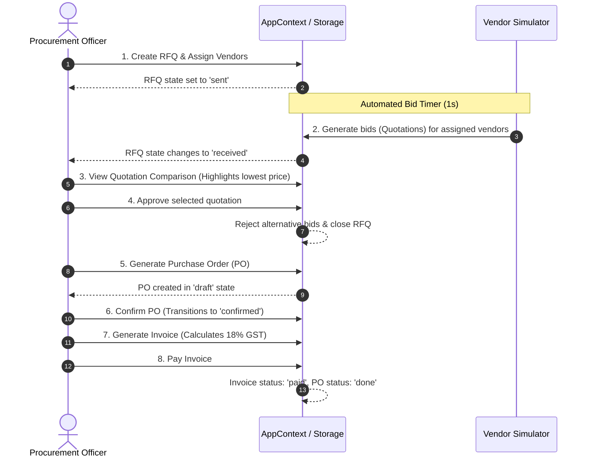

# VendorBridge Frontend - Technical Architecture & Approach

This document provides a comprehensive, step-by-step technical explanation of the frontend part of **VendorBridge**. It covers the design approach, architecture, key code modules, and the step-by-step lifecycle of the system.

---

## 1. Architectural Approach & Tech Stack

The frontend is built as a single-page application (SPA) designed to serve as a high-fidelity interactive prototype. 



### Core Technologies
*   **Vite + React.js**: Provides a lightning-fast build system and component-driven view layer.
*   **React Router DOM (v7)**: Manages clean client-side routing, query parameters, and redirects.
*   **Lucide React**: Supplies clean, outline-style vector icons for standard ERP navigation.
*   **Vanilla CSS**: Built with CSS variables and flexbox/grid layouts for a premium theme with zero Tailwind dependencies.

---

## 2. Step-by-Step Technical Breakdown

### Step 1: Global State Management ([AppContext.jsx](file:///d:/New%20folder/frontend/src/context/AppContext.jsx))
Instead of a complex state manager like Redux, we leverage **React Context** to serve as our central database:
1.  **State Initialization**: States (vendors, RFQs, quotations, approvals, POs, invoices, logs) are initialized from `localStorage` using lazy initial state function calls:
    ```javascript
    const [vendors, setVendors] = useState(() => {
      const saved = localStorage.getItem('vb_vendors');
      return saved ? JSON.parse(saved) : initialVendors;
    });
    ```
2.  **Persistence Sync**: Whenever any state modifications occur, `useEffect` hooks automatically write the updated array back to `localStorage` as serialized JSON.
3.  **Auditing (Activity Logs)**: Every workflow transition invokes `logActivity(action, remarks)`. To prevent duplicate key warnings in rendering, each log is assigned a unique identifier using a combination of the timestamp and a random hash string:
    ```javascript
    id: `${Date.now()}-${Math.random().toString(36).substring(2, 9)}`
    ```

### Step 2: Automated Quotation Simulation
To make the application demo-ready, we simulated vendor participation:
1.  When a Procurement Officer dispatches an RFQ, `createRfq()` is called.
2.  The function starts a `setTimeout` timer (1-second delay).
3.  In the background, it loops through the assigned vendor IDs, generates automated compliant quotation bids with randomized unit prices, builds line items, and pushes them to the state.
4.  This triggers a state change, transitioning the RFQ status to `received` ("Quotations Received") and populating the approvals queue dynamically.

### Step 3: Layout & Route Protection ([App.jsx](file:///d:/New%20folder/frontend/src/App.jsx))
Access control is managed via a React wrapper component:
*   **`ProtectedLayout`**: Checks the `user` object in the context. If the user is authenticated, it renders the global grid layout composed of the collapsible [Sidebar](file:///d:/New%20folder/frontend/src/components/Sidebar.jsx) and top [Navbar](file:///d:/New%20folder/frontend/src/components/Navbar.jsx). If unauthenticated, it redirects to `/login`.

### Step 4: Component-Driven Design System
We structured reusable visual patterns into modular components:
*   **[DataTable.jsx](file:///d:/New%20folder/frontend/src/components/DataTable.jsx)**: A highly reusable table grid that accepts data columns, handles local searching/filtering via text input, and sorting parameters.
*   **[StatusBadge.jsx](file:///d:/New%20folder/frontend/src/components/StatusBadge.jsx)**: Normalizes status strings (e.g., `under_review`, `confirmed`, `paid`) to modern colored badges using semantic CSS color mappings.
*   **[MetricCard.jsx](file:///d:/New%20folder/frontend/src/components/MetricCard.jsx)**: Used across the dashboard to render high-level counts with specific accent background colors.

### Step 5: Visual Styling System ([index.css](file:///d:/New%20folder/frontend/src/index.css))
The design avoids standard colors by defining a curated, modern HSL design tokens palette:
```css
:root {
  --primary: 221 83% 53%;       /* Cobalt Blue */
  --primary-hover: 221 83% 45%;
  --success: 142 76% 36%;       /* Emerald Green */
  --warning: 38 92% 50%;        /* Gold */
  --danger: 0 84% 60%;          /* Soft Coral Red */
  --background: 210 20% 98%;    /* Off-white canvas */
  --surface: 0 0% 100%;         /* White card container */
  --text: 222 47% 11%;          /* Slate Black */
  --border: 214 32% 91%;        /* Soft grey divider */
}
```
Layout alignment utilizes a three-column CSS Grid layout for page panels and responsive flexboxes for lists.

---

## 3. The Document Lifecycle Workflow

The following sequence details how documents transition through the ERP logic:



*   **Lowest Bid Indicator**: Implemented in [QuotationComparison.jsx](file:///d:/New%20folder/frontend/src/pages/QuotationComparison.jsx). It computes the minimum price among received bids:
    ```javascript
    const lowestPrice = Math.min(...rfqQuotations.map(q => q.price));
    ```
    During grid rendering, if `q.price === lowestPrice`, a special success styling class is dynamically attached to highlight it to the Procurement Officer.
*   **State Alignment**: In [PurchaseOrders.jsx](file:///d:/New%20folder/frontend/src/pages/PurchaseOrders.jsx) and [Invoices.jsx](file:///d:/New%20folder/frontend/src/pages/Invoices.jsx), primary actions trigger consecutive updates (e.g., clicking "Pay" on an invoice updates both the invoice status and the linked PO's status, ensuring data consistency).
